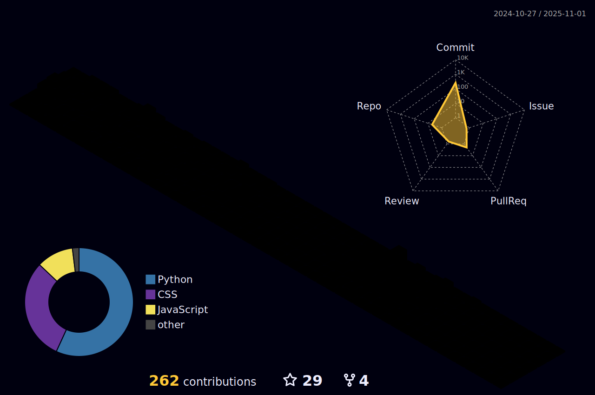

 

### Hi,I'm Bahman Pournazari and interested in Python,Django and web developing

<h3> I’m currently learning Advanced Django topics.I will be happy to connecting with other developers and talk about developing; specially fields that i am active in!</h3>

🌐[my site](http://bahmanpn.pythonanywhere.com)

<h4>📫 bahmanpn@gmail.com</h4>

 
<h2>Social Networks</h2>

[![LinkedIn][1.2]][1] [![Telegram][2.2]][2]

[1.2]: https://s4.uupload.ir/files/linkedin_amwn.png

[2.2]: https://s4.uupload.ir/files/telegram_q47u.png

[1]: https://www.linkedin.com/in/bahman-pournazariii

[2]: https://telegram.me/bahmanpnn

 
 

 
<h2>Skills</h2>

  

  

  
<b>:gear: &nbsp;Git statistics</b>

  

  

 
  
 

  
  

 

